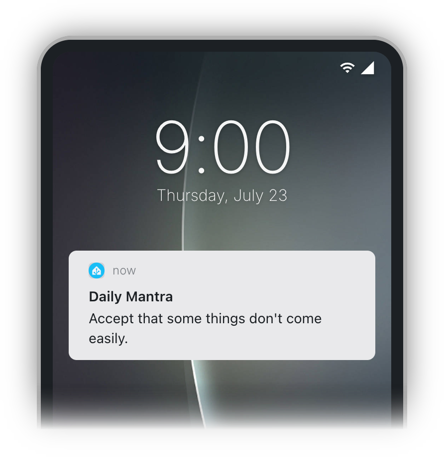

  

# daily-mantra

> Send yourself daily guiding reminders generated from your own notes

## Why?

I tend to take notes during my therapy sessions, usually in a loose, unstructured format, taking note of things I want to remember moving forward or change about my behavior.

The problem is that I don't often go back and look through all my past notes to remind myself of the insights I gained.

So one day I had a random idea to:

1. Use an LLM to generate self-contained "mantras" from my raw, unstructured notes
1. Send my phone a daily notification with one of the randomly-chosen mantras

That's it, that's the whole thing.

## How?

Instead of building my own mobile app or [PWA](https://developer.chrome.com/blog/getting-started-pwa) to serve these notifications, I wanted to utilize [Home Assistant](https://www.home-assistant.io/), which I already use, and already has the ability to automate sending custom notifications.

This makes the architecture pretty simple:

**Mantra Service**

- Runs inside my network (always accessible by HASS, and stays private)
- Fetches and aggregates my notes, passes them through an LLM to generate and add any new mantras to the list (if the notes content has changed)

**Home Assistant Automation**

- Every day at 9am, hit the `/random-mantra` endpoint of the service to get the mantra of the day
- Send it as a push notification to my phone

## Run it

For info on running this for yourself, see [DOCS.md](./DOCS.md).

## License

[MIT](./LICENSE)
